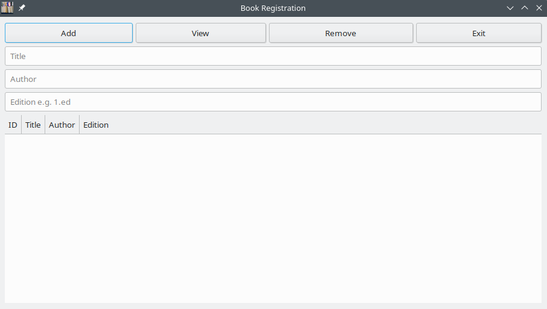

# Book-Manager
A book cataloger program
# Book Manager

## ABOUT

This is a C program with GTK interface for for storing books data like title, author and edition.

## Screenshot



## Installation

### Manual Installation

Clone the repository and navigate into the project directory, build and install:

```bash
git clone https://github.com/profmatjr/books_list.git
cd books_list
make
sudo make install

```

##That's it!!!


